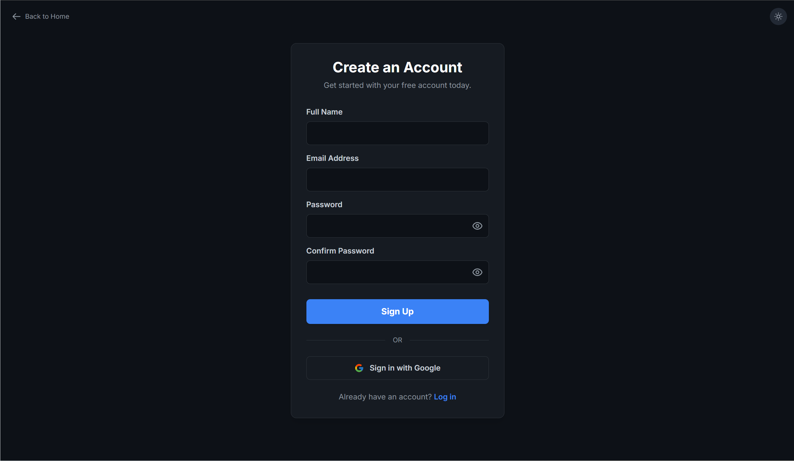
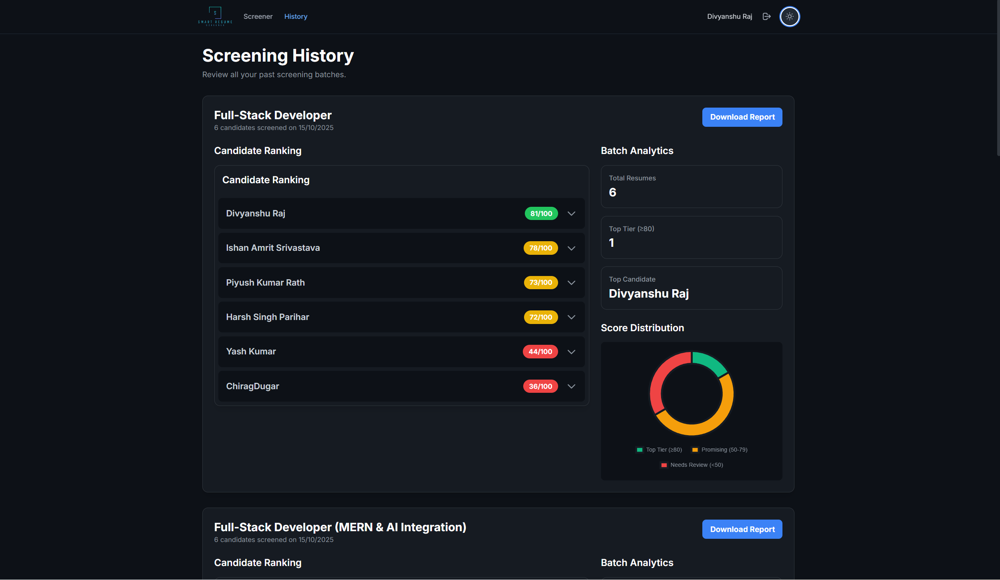
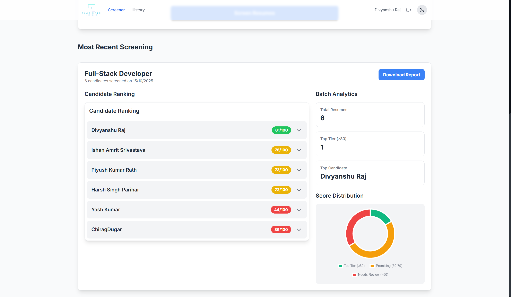
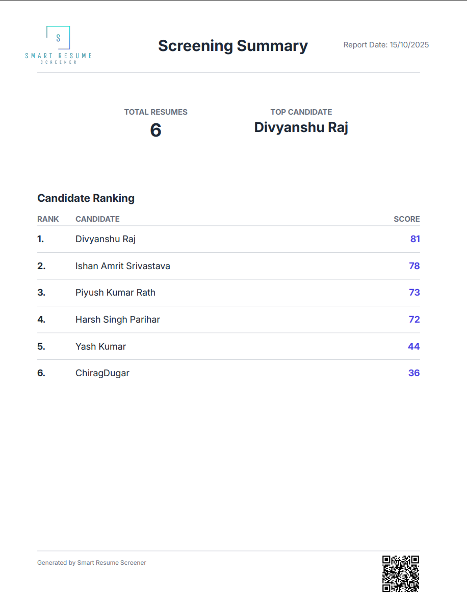
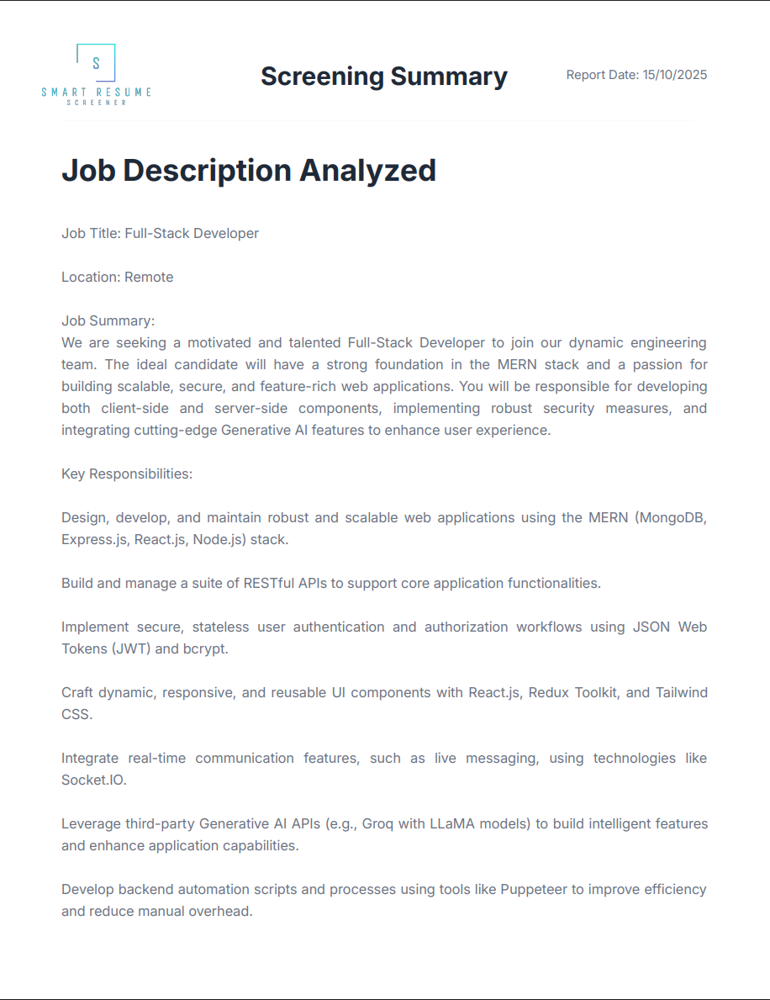

# Smart Resume Screener

<p align="center">
  
</p>

<p align="center">
  <strong>An AI-powered resume screener that automates candidate evaluation and generates professional PDF reports.</strong>
</p>

<p align="center">
  <a href="https://github.com/divyanshu02raj/Smart-Resume-Screener">
    
  </a>
  <a href="https://github.com/divyanshu02raj/Smart-Resume-Screener/stargazers">
    
  </a>
  <a href="https://github.com/divyanshu02raj/Smart-Resume-Screener/network/members">
    
  </a>
</p>

<p align="center">
  
  
  
  
  
  
  
  
</p>

<p align="center">
  
  
</p>

## 🎬 Demo / Live Preview

Experience the **Smart Resume Screener** in action:

- **Live Demo:** [Click here to try the app](https://smart-resume-screener-one.vercel.app)
- **Video Demo:** [Watch the walkthrough](https://youtu.be/JzD-zPvhGPw)
- **Source Code:** [GitHub Repository](https://github.com/divyanshu02raj/Smart-Resume-Screener)


## 📑 Table of Contents
1. [Overview](#1-overview)
2. [Key Features](#2-key-features)
3. [Tech Stack](#3-tech-stack)
4. [Screenshots](#4-screenshots)
5. [Architecture](#5-architecture)
6. [Architecture Diagram](#6-architecture-diagram)
7. [The LLM Prompt](#7-the-llm-prompt)
8. [Folder Structure](#8-folder-structure)
9. [How to Run Locally](#9-how-to-run-locally)
10. [Future Enhancements](#10-future-enhancements)
11. [Contributing](#11-contributing)
12. [Acknowledgments](#12-acknowledgments)
13. [Author](#13-author)


## 1. Overview

The **Smart Resume Screener** is a sophisticated, full-stack web application designed to revolutionize the initial stages of the hiring process.  
This tool empowers recruiters and hiring managers to move beyond manual, time-consuming resume reviews by leveraging **advanced AI** to intelligently **parse, score, and rank candidates** in bulk.

Built with the modern **MERN stack** and powered by the **Gemini API**, this application provides a secure, multi-user environment where users can manage screening history, analyze candidates with a detailed, multi-criteria scoring system, and generate professional PDF reports for offline sharing.

## 2. Key Features

This project goes far beyond a basic resume parser, incorporating a suite of professional-grade features:


1. **Secure Multi-User Authentication**  
A complete authentication system with **JWT** allows users to sign up, log in, and maintain a private, persistent history of their screenings.

2. **AI-Powered Multi-Criteria Scoring**  
Instead of a simple score, the application uses an **advanced AI prompt** to evaluate candidates on four distinct criteria:
- **Experience**
- **Skills**
- **Project Quality**
- **Education**

  A final weighted score provides a **nuanced and genuine assessment**.

3. **Batch Resume Processing**  
Users can upload **multiple resumes at once** against a single job description.  
The system processes them concurrently and groups them into a **“Screening Batch”** for organized analysis.

4. **Interactive Analytics Dashboard**  
A sleek, professional dashboard displays a **ranked list of candidates** for each batch.  
It includes high-level analytics such as:
- Number of top-tier candidates  
- Score distribution **donut chart** for at-a-glance insights.

5. **Professional PDF Report Generation**
Users can download a comprehensive, **multi-page PDF report** for any screening batch.  
The report includes:
- A summary  
- The full job description  
- A detailed, two-column analysis for each candidate.

6. **Dual-Theme UI**
The entire application supports a **seamless light/dark theme** toggle, with user preferences saved locally in the browser.

## 3. Tech Stack

| **Category**   | **Technology / Library** |
|----------------|-------------------------|
| **Frontend**   | React, React Router, Tailwind CSS, Framer Motion, Chart.js, Axios |
| **Backend**    | Node.js, Express.js |
| **Database**   | MongoDB with Mongoose |
| **AI Model**   | Google Gemini API (`gemini-flash-latest`) |
| **Security**   | JWT (authorization), bcryptjs (password hashing) |
| **PDF Tools**  | pdfkit (generation), pdf2json (parsing) |
| **Deployment** | Frontend → Vercel, Backend → Render |


## 4. Screenshots

- #### Landing Page:
The public-facing entry point of the application, featuring a dark-mode theme, headline, key value proposition cards, and call-to-action buttons.


---

- #### User Authentication:
Secure and seamless authentication with Signup and Login pages.

**Signup Page:**


**Login Page:**


---

- #### Main Application Dashboard:
Central hub for creating new screenings, viewing recent screenings, and uploading multiple resumes.


---

- #### Screening History:
Overview of all past screening batches, grouped by job title, with mini-dashboard analytics on each batch.



---

- #### Interactive Batch Analytics & Results:
Detailed insights for each batch: candidate ranking, score distribution, and expandable candidate analysis.




---

- #### Professional PDF Report:
Multi-page report for offline sharing, including summary, job description, and detailed candidate analysis.





## 5. Architecture

The application follows a standard and scalable full-stack architecture with a clear separation of concerns:

**End-to-End Flow:**  
1. **Frontend (React SPA)** → Users interact with dashboards, upload resumes, view analytics.  
2. **Backend (Node.js + Express)** → Handles authentication, batch processing, AI integration, and PDF generation.  
3. **AI Integration (Gemini API)** → Scores resumes based on multi-criteria prompt.  
4. **Database (MongoDB)** → Stores users, batches, and candidate data.  
5. **PDF Tools (pdfkit / pdf2json)** → Produces multi-page reports for offline sharing.

### 🖥️ React Frontend
- Single Page Application (SPA) for all user interactions.  
- Navigation via React Router.  
- Tailwind CSS for responsive design and Framer Motion for smooth animations.  
- Chart.js for analytics charts and Axios for API calls.  
- Context API manages global state (authentication, theme preferences).

### ⚙️ Node.js / Express Backend
- REST API server for authentication, business logic, AI integration, and data persistence.  
- JWT + bcryptjs for secure authentication.  
- Middleware protects critical routes.  
- Communicates with Gemini API using an advanced, persona-driven prompt.  
- PDF generation using pdfkit for professional, multi-page reports.

### 🗄️ MongoDB Database
- Stores users, screening batches, and candidates in structured collections.  
- Efficient schema design ensures scalable batch-oriented storage.

## 6. Architecture Diagram
The diagram below illustrates the end-to-end flow of the Smart Resume Screener application, showing how the **frontend**, **backend**, and **AI integration** work together.


---

## 7. The LLM Prompt

A core component of this project is the **advanced prompt engineering** used to elicit high-quality, structured, and nuanced results from the Gemini API.  
This prompt defines a **professional persona** and a **multi-criteria rubric** for candidate evaluation.


You are an elite technical recruiter and former Principal Engineer at a top tech company.  
You have extremely high standards and an expert eye for talent.  
Your task is to analyze the provided resume against the job description with meticulous detail and provide a brutally honest, structured evaluation in a JSON object.

---


### **Internal Thought Process (Follow these steps silently before generating the JSON):**
1. **First Pass:** Read the entire resume to get a general impression.  
2. **Keyword Match:** Compare the specific technologies, languages, and tools listed in the “Required Skills” of the job description against the resume. Be strict.  
3. **Impact Assessment:** Scrutinize the project and experience descriptions for quantifiable results (e.g., numbers, percentages, user metrics).  
4. **Quality Assessment:** Evaluate the depth and complexity of the projects — tutorial clones vs. real problem-solving.  
5. **Final Deliberation:** Based on the above, assign scores for each criterion using the rubric below.

---

### **Scoring Rubric (Scores 1–10)**

| Criterion | Description |
|------------|--------------|
| **Experience_Relevance** | 10 = Perfect match; 7–9 = Relevant project/internship; 4–6 = Some relevance; 1–3 = None |
| **Skills_Match** | 10 = Matches all skills; 7–9 = Matches most; 4–6 = Partial match; 1–3 = Few or none |
| **Project_Quality** | 10 = Exceptional originality and impact; 7–9 = Strong and relevant; 4–6 = Standard/tutorial; 1–3 = Weak |
| **Educational_Fit** | 10 = Perfect degree match; 7–9 = Relevant field; 4–6 = Some coursework; 1–3 = Unrelated |

---

### **Required JSON Output Format**

```json
{
  "candidate_name": "Full Name",
  "justification": "Your brutally honest, expert justification for the overall score.",
  "candidate_skills": ["List of skills found"],
  "missing_skills": ["List of skills missing"],
  "criteria_scores": {
    "Experience_Relevance": <Score>,
    "Skills_Match": <Score>,
    "Project_Quality": <Score>,
    "Educational_Fit": <Score>
  }
}
```
🧮 Weighted Scoring Formula
Each candidate’s Final Score is computed using a weighted average:

Final Score = 0.35 * Experience_Relevance + 0.30 * Skills_Match + 0.25 * Project_Quality + 0.10 * Educational_Fit

📊 Sample Output (from Gemini API)
```json
{
  "candidate_name": "Aarav Sharma",
  "justification": "Aarav has hands-on MERN experience, including production-grade projects with authentication and deployment. Missing some DevOps exposure.",
  "candidate_skills": ["React", "Node.js", "MongoDB", "Express.js", "JWT", "Tailwind CSS"],
  "missing_skills": ["Docker", "AWS"],
  "criteria_scores": {
    "Experience_Relevance": 9,
    "Skills_Match": 8,
    "Project_Quality": 8,
    "Educational_Fit": 9
  },
  "final_score": 8.4
}
```


## 8. Folder Structure

```text
smart-resume-screener/
│
├── LICENSE
├── README.md
├── backend/
│   ├── assets/
│   │   ├── app_logo.png
│   │   ├── Inter-Bold.ttf
│   │   └── Inter-Regular.ttf
│   ├── controllers/
│   │   ├── screenController.js
│   │   └── userController.js
│   ├── middleware/
│   │   └── authMiddleware.js
│   ├── models/
│   │   ├── Candidate.js
│   │   ├── ScreeningBatch.js
│   │   └── User.js
│   ├── routes/
│   │   ├── screen.js
│   │   └── user.js
│   ├── services/
│   │   └── reportGenerator.js
│   ├── .env
│   ├── .gitignore
│   ├── index.js
│   ├── package-lock.json
│   └── package.json
└── frontend/
    ├── public/
    │   └── ... (public assets like logo.png, index.html)
    ├── src/
    │   ├── components/
    │   │   ├── AuthLayout.jsx
    │   │   ├── BatchCard.jsx
    │   │   └── ... other components
    │   ├── context/
    │   ├── features/
    │   ├── pages/
    │   ├── App.js
    │   └── index.js
    ├── package.json
    └── tailwind.config.js

```


## 9. How to Run Locally

### Prerequisites
- Node.js v18+
- MongoDB
- Gemini API key

## Steps:

#### 1️⃣ Clone the repository
```bash
git clone https://github.com/yourusername/smart-resume-screener.git
cd smart-resume-screener
```

#### 2️⃣ Install dependencies for the backend
```bash
cd backend
npm install
```

#### 3️⃣ Install dependencies for the frontend
```bash
cd ../frontend
npm install
```

#### 4️⃣ Create a .env file inside the backend directory with the following:
```bash
PORT=5000
MONGO_URI=your_mongodb_connection_string
JWT_SECRET=your_jwt_secret
GEMINI_API_KEY=your_gemini_api_key
```

#### 5️⃣ Start the backend server
```bash
cd ../backend
npm start
```

#### 6️⃣ Start the frontend app
```bash
cd ../frontend
npm start
```


## 10. Future Enhancements

Planned improvements for upcoming versions are categorized into **high priority**, **nice-to-have**, and **stretch goals / AI improvements**:

### 🔹 High Priority
- **Job Description Templates:** Predefined templates for HR teams to standardize evaluations.  
- **Email-Based Shortlisting:** Generate automated emails for selected candidates.  
- **Advanced Analytics:** More visualizations and insights for batch evaluations (score distributions, trends over time).

### 🔹 Nice-to-Have
- **Multi-Language Support:** Extend support for non-English resumes and job descriptions.
- **User Roles & Permissions:** Allow different levels of access for HR assistants, managers, and admins.

### 🔹 Stretch Goals / AI Improvements
- **Smarter Skill Extraction:** Automatically detect implicit skills from experience/project descriptions.  
- **AI-Powered Trend Analysis:** Predict hiring trends based on past screening data.  
- **ML-Powered Candidate Ranking:** Complement Gemini scores with historical performance data for more accurate recommendations.


## 11. Contributing

Contributions are what make the open-source community amazing! Any contributions you make are **greatly appreciated**.

### Steps to Contribute:

1. **Fork the Project**  
   Click the “Fork” button at the top of the repository to create your own copy.

2. **Create a Feature Branch**  
   ```bash
   git checkout -b feature/AmazingFeature
3. **Commit Your Changes**
    ```bash
    git add .
    git commit -m "Add some AmazingFeature"
    ```
4. **Push to the Branch** 
    ```bash
    git push origin feature/AmazingFeature
    ```
5. **Open a Pull Request**   
    ```bash
    git push origin feature/AmazingFeature
    ```

## 12. Acknowledgments
Special thanks to the amazing tools, libraries, and APIs that made this project possible:


- Google Gemini API — AI-powered resume analysis

- pdfkit / pdf2json — Professional PDF generation and parsing

- Tailwind CSS — Beautiful, responsive styling

- Chart.js — Interactive analytics charts

- Framer Motion — Smooth animations

All other open-source libraries listed in package.json
## 13. Author

Divyanshu Raj   
📧 Email: [divyanshuraj2206@gmail.com](mailto:divyanshuraj2206@gmail.com)  
🌐 GitHub: [https://github.com/divyanshuraj2206](https://github.com/divyanshuraj2206)  
💼 LinkedIn: [https://www.linkedin.com/in/div02raj](https://www.linkedin.com/in/div02raj)

